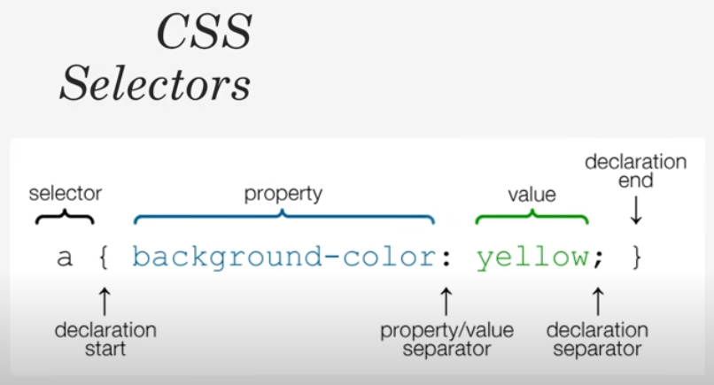
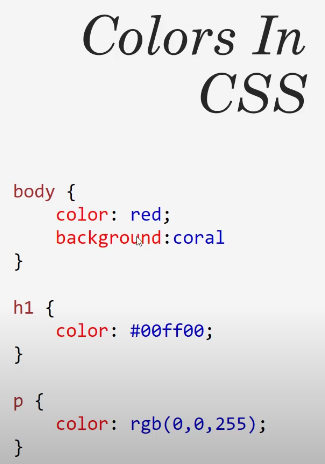
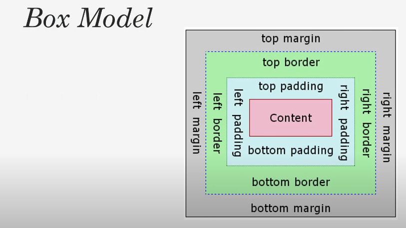
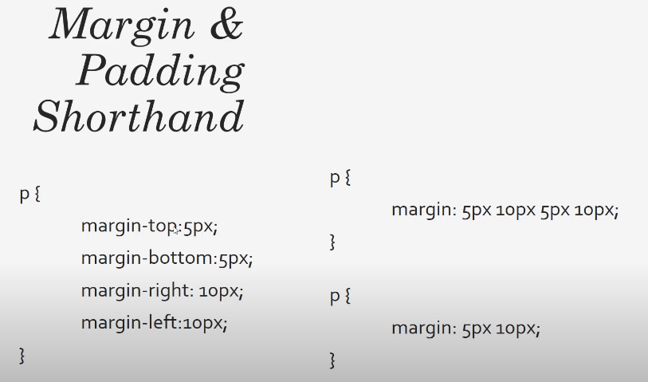
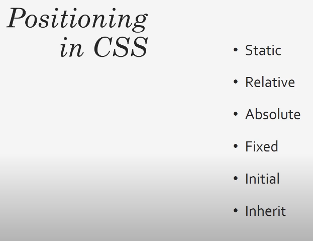

# Learning CSS

## CSS Slides







## Code

### Basic usage:

```css
body {
    background-color: #f4f4f4;
    color: #555555;

    font-family: Arial, Helvetica, sans-serif;
    font-size: 12px;
    font-weight: normal;

    /*Same as above*/
    font: normal 16px Arial, Helvetica, sans-serif;

    line-height: 1.6em;
}
```

### Influence all tags:

```css
*{
    margin: 0;
    padding: 0;
}
```

### Padding, Border, Margin:

```css
.box-1 {
    background-color: #333;
    color: #fff;

    border-right: 5px red solid;
    border-left: 5px red solid;
    border-top: 5px red solid;
    border-bottom: 5px red solid;
    /*Same as abouve*/
    /*border: 5px red solid;*/
    border-width: 3px;
    border-bottom-width: 10px;
    border-top-style: dotted;

    padding: 20px;

    margin: 20px 0;
}
```

### Text:

```css
.box-1 h1{
    font-family: Tahoma;
    font-weight: bold;
    font-style: italic;
    text-decoration: underline;
    text-transform: uppercase;
    letter-spacing: 0.2em;
    word-spacing: 1em;

}
```

### Links:

```css
a{
    text-decoration: none;
    color: black;
}

a:hover{
    color: red;
}

a:active{
    color: green;
}

a:visited{
    color: black;
}
```

### Positioning:

Fixed:
```css
.fix-me {
    position: fixed;
    top: 200px;
}
```

Relative:
```css
.p-box {
    width: 800px;
    height: 500px;
    border: 1px solid;
    margin-top: 20px;
    position: relative;
}

.p-box h1 {
    position: absolute;
    top: 100px;
    left: 200px;
}

.p-box h2 {
    position: absolute;
    bottom: 40px;
    right: 100px;
}
```

## Credits

- [youtube | CSS Crash Course For Absolute Beginners](https://www.youtube.com/watch?v=yfoY53QXEnI&t=4154s)